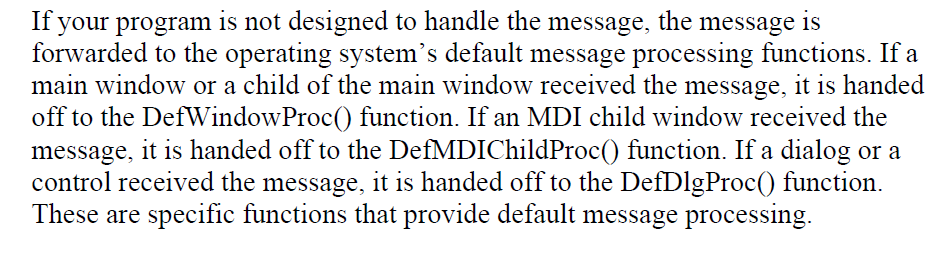

### MFC internals: From book "Learn the MFC C++ Classes (Shirley Wodtke)":




### Registering a New Window Class

Windows OS keeps track of a set of basic window features which are: class style, backgraound color, cursor, and icon. This set of features is set to define a **window class**. The term window class is a unique usage. In this usage, the word class is specific to the Window OS environment and has nothing to do with the definition of a C++ class. The windows within a class share a few common characteristics, such as having the same class style, using the same brush color to fill the client area of the window (background color), displaying the same cursor shape when the mouse is over the window, and displaying the same icon when minimized.

You can register a new window class by calling the AfxRegisterWndClass global function.

LPCSTR AfxRegisterWndClass(UINT nClassStyle, HCURSOR hCursor = 0, HBRUSH hbrBackground = 0, HICON hIcon = 0);

You can pass result to CFrameWnd::Create() member function.
```
C_MainFrame::C_MainFrame()
{
    HBRUSH hredBrush = ::CreateSolidBrush(RGB(255,0,0));
    CString MyWindowClass = AfxRegisterWndClass(
    CS_DBLCLKS | CS_HREDRAW | CS_VREDRAW,
    AfxGetApp()->LoadStandardCursor(IDC_UPARROW), hredBrush,
    AfxGetApp()->LoadStandardIcon(IDI_EXCLAMATION));
    Create (MyWindowClass, "Main Window C");
    ::DeleteObject(hredBrush);
}

Other class styles— CS_BYTEALIGNCLIENT, CS_BYTEALIGNWINDOW, and CS_SAVEBITS—are used to improve drawing speed and efficiency.
```

